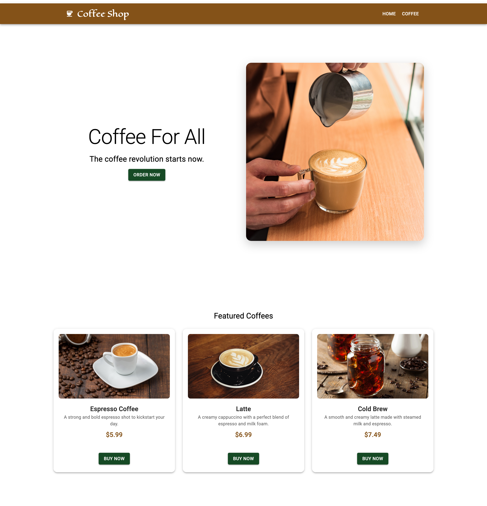

# Bookmark App Website

## Table of contents

- [Table of contents](#table-of-contents)
- [Overview](#overview)
  - [The challenge](#the-challenge)
  - [Screenshot](#screenshot)
  - [Links](#links)
- [My process](#my-process)
  - [Built with](#built-with)
- [Author](#author)

## Overview

- React fundamentals with state management
- Material UI components

### Screenshot

### Links

- Solution URL: [https://github.com/andrewteece/Shortly-Website](https://github.com/andrewteece/Shortly-Website)
- Live Site URL: [https://adorable-tulumba-ffa30e.netlify.app/](https://adorable-tulumba-ffa30e.netlify.app/)

### Built with

- React 19.1.0
- Material UI 7.2.0

## Author

- Website - [https://andrewteece.com](https://andrewteece.com)

