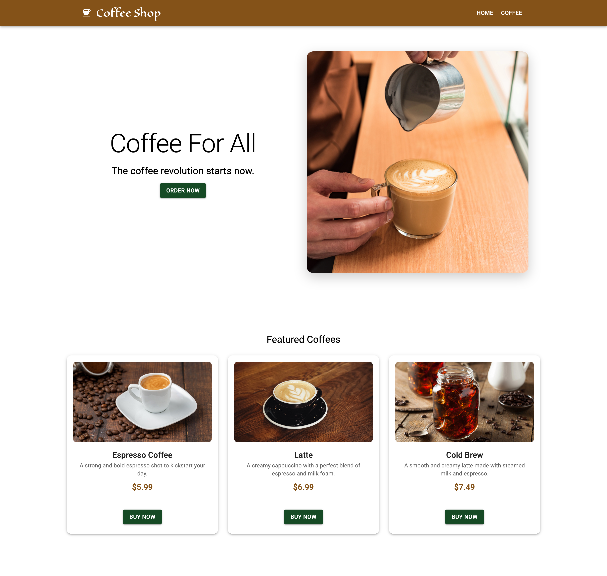

# Coffee Shop App with React 19 and Material UI 7

## Table of contents

- [Table of contents](#table-of-contents)
- [Overview](#overview)
  - [Screenshot](#screenshot)
  - [Links](#links)
- [My process](#my-process)
  - [Built with](#built-with)
  - [Next Steps for Project](#next-steps-for-project)
- [Author](#author)

## Overview

- React fundamentals with state management
- Material UI components

### Screenshot

### Links

- Code URL: [https://github.com/andrewteece/coffeeShop](https://github.com/andrewteece/coffeeShop)
- Live Site URL: [https://coffee-shop-5k1rtk0qk-andrewteeces-projects.vercel.app/](https://coffee-shop-5k1rtk0qk-andrewteeces-projects.vercel.app/)

### Built with

- React 19.1.0
- Material UI 7.2.0

### Next Steps for Project

- Light/Dark mode
- Fake Coffee API 
- Add Cart system

## Author

- Website - [https://andrewteece.com](https://andrewteece.com)

